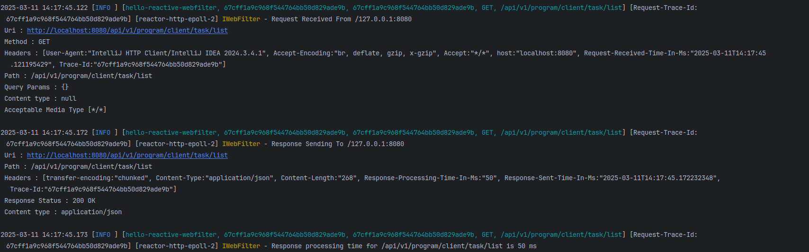

# Hello Reactive Spring Base

A Spring Boot WebFlux application demonstrating reactive programming with a focus on cross-cutting concerns like request/response filtering, distributed tracing, and structured logging.

## Overview

This project showcases how to implement and configure:

- Reactive WebFilters for request/response processing
- Distributed tracing with Micrometer and Zipkin
- Context propagation in reactive streams
- Structured logging with Logback and MDC
- WebClient configuration with timeout and tracing

## Key Features

- **Reactive Programming**: Built with Spring WebFlux and Project Reactor
- **Request/Response Filtering**: Custom WebFilter implementation for request/response processing
- **Distributed Tracing**: Micrometer tracing integration with Zipkin
- **Structured Logging**: JSON logging with MDC context propagation
- **Error Handling**: Centralized error handling for business and technical exceptions
- **WebClient Configuration**: Configured with timeout, tracing, and logging

## Technologies

- Java 21
- Spring Boot 3.4.2
- Spring WebFlux
- Project Reactor
- Micrometer Tracing
- Zipkin
- Logback with Logstash encoder
- ModelMapper
- Lombok

## Setup and Configuration

### Prerequisites

- JDK 21
- Gradle
- Zipkin (optional, for distributed tracing)

### Running the Application

```bash
./gradlew bootRun
```

### Building the Application

```bash
./gradlew build
```

## Code Highlights

### Reactive WebFilter Implementation

The `IWebFilter` class implements Spring's `WebFilter` interface to process incoming requests and outgoing responses:

```java
@Component
@Slf4j
@RequiredArgsConstructor
public class IWebFilter implements WebFilter {

    private final Tracer tracer;

    @Override
    public Mono<Void> filter(ServerWebExchange serverWebExchange, WebFilterChain webFilterChain) {
        ServerWebExchange mutatedServerWebExchange = setRequestHeaders(serverWebExchange);
        setMdcAttributeForLogBack(mutatedServerWebExchange);
        logRequest(mutatedServerWebExchange.getRequest());
        setResponseHeader(mutatedServerWebExchange);
        logResponse(mutatedServerWebExchange);

        Map<String, String> mdcContextMap = MDC.getCopyOfContextMap(); // copy the current MDC context

        return webFilterChain.filter(serverWebExchange)
            .contextWrite(ctx -> ctx.put("mdcContextMap", mdcContextMap)); // put the MDC context into the subscriber context
    }
    
    // ... other methods
}
```

Key aspects:
- Sets request headers including trace IDs
- Populates MDC context for logging
- Logs request and response details
- Propagates MDC context through the reactive chain
- Calculates and logs response processing time

### Automatic Context Propagation

The application enables automatic context propagation in Project Reactor, which is crucial for maintaining context (like MDC values) across asynchronous boundaries:

```java
@SpringBootApplication
public class HelloReactiveWebFilterApplication {

    public static void main(String[] args) {
        Hooks.enableAutomaticContextPropagation();
        SpringApplication.run(HelloReactiveWebFilterApplication.class, args);
    }
}
```

The `Hooks.enableAutomaticContextPropagation()` line is essential for ensuring that context like trace IDs and MDC values are properly maintained when crossing thread boundaries in the reactive pipeline.

### MDC Context Propagation

The filter captures the MDC context and propagates it through the reactive chain:

```java
Map<String, String> mdcContextMap = MDC.getCopyOfContextMap(); // copy the current MDC context

return webFilterChain.filter(serverWebExchange)
    .contextWrite(ctx -> ctx.put("mdcContextMap", mdcContextMap)); // put the MDC context into the subscriber context
```

This ensures that logging context is maintained across asynchronous boundaries.

### Distributed Tracing with Micrometer

The application integrates Micrometer for distributed tracing:

```gradle
// From build.gradle
implementation 'io.micrometer:micrometer-tracing-bridge-brave'
implementation 'io.zipkin.reporter2:zipkin-reporter-brave'
```

```java
// From application.properties
management.tracing.enabled=true
management.tracing.sampling.probability=1.0
management.zipkin.tracing.endpoint=http://localhost:9411/api/v2/spans
```

Trace IDs are propagated in request/response headers:

```java
private ServerWebExchange setRequestHeaders(ServerWebExchange serverWebExchange) {
    return serverWebExchange.mutate()
            .request(originalRequest -> originalRequest.headers(headers -> {
                headers.set(HeaderNames.REQUEST_RECEIVED_TIME_IN_MS.getValue(), LocalDateTime.now().toString());

                String traceId = headers.getOrEmpty(HeaderNames.TRACE_ID.getValue())
                        .stream()
                        .findFirst()
                    .orElseGet(() -> {
                        if (tracer.currentSpan() != null) {
                            return Objects.requireNonNull(tracer.currentSpan()).context().traceId();
                        } else {
                            return "default-trace-id";
                        }
                    });

                headers.set(HeaderNames.TRACE_ID.getValue(), traceId);
            }))
            .build();
}
```

### Structured Logging with Logback

The application uses Logback with Logstash encoder for structured logging:

```xml
<!-- Rolling File Appender for Plain Logs -->
    <appender name="RollingFile" class="ch.qos.logback.core.rolling.RollingFileAppender">
        <file>${LOG_DIR}/app.log</file>
        <encoder class="ch.qos.logback.classic.encoder.PatternLayoutEncoder">
            <pattern>
                %d{yyyy-MM-dd HH:mm:ss.SSS} [ ${spring.application.name}, %X{spanId:-}, %X{traceId:-}, %X{Method} %X{Uri} ] [Request-Trace-Id: %X{Trace-Id}] [%t] %-5level %class{0} - %msg%n%throwable
            </pattern>
        </encoder>
        <rollingPolicy class="ch.qos.logback.core.rolling.TimeBasedRollingPolicy">
            <fileNamePattern>${LOG_DIR}/archived/app-%d{yyyy-MM-dd_HH}.log.gz</fileNamePattern>
            <maxHistory>${MAX_HISTORY}</maxHistory>
            <maxFileSize>${MAX_FILE_SIZE}</maxFileSize>
        </rollingPolicy>
    </appender>
```

Properties to control the log file management:

```properties
LOG_DIR=/tmp/logs
MAX_FILE_SIZE=15MB
MAX_HISTORY=20
LOG_LEVEL_ROOT=INFO
```

Add dependency in build.gradle:

```gradle
implementation 'net.logstash.logback:logstash-logback-encoder:7.4'
```

The MDC context is populated with request information:

```java
private void setMdcAttributeForLogBack(ServerWebExchange serverWebExchange) {
    MDC.put("Method", Objects.requireNonNull(serverWebExchange.getRequest().getMethod()).name());
    MDC.put("Uri", serverWebExchange.getRequest().getPath().value());
    final String traceId;
    final String spanId;
    if (tracer.currentSpan() != null) {
        traceId = Objects.requireNonNull(tracer.currentSpan()).context().traceId();
    } else {
        traceId = "default-trace-id";
    }
    if (tracer.currentSpan() != null) {
        spanId = Objects.requireNonNull(tracer.currentSpan()).context().spanId();
    } else {
        spanId = "default-span-id";
    }
    MDC.put("traceId", Objects.requireNonNull(serverWebExchange.getRequest().getHeaders().get(HeaderNames.TRACE_ID.getValue()))
        .stream()
        .findFirst()
        .orElseGet(() -> traceId));
    MDC.put("spanId", Objects.requireNonNull(serverWebExchange.getRequest().getHeaders().get(HeaderNames.TRACE_ID.getValue()))
        .stream()
        .findFirst()
        .orElseGet(() -> spanId));
    MDC.put("Request-Trace-Id", Objects.requireNonNull(serverWebExchange.getRequest().getHeaders().get(HeaderNames.TRACE_ID.getValue()))
        .stream()
        .findFirst()
        .orElseGet(() -> traceId));
}
```

### Log with processsed request in webfilter



### Enabling Context Propagation Across Threads in Reactive Spring

To ensure that the same trace ID is propagated when switching threads in a reactive Spring application, the following configuration is added. This configuration uses Reactor's `Hooks` to enable MDC (Mapped Diagnostic Context) propagation across thread boundaries:

```java

@Configuration
public class HooksConfig {

    public HooksConfig() {
        Hooks.onEachOperator(ApplicationContext.class.getName(), Operators.lift((scannable, coreSubscriber) -> new CoreSubscriber<Object>() {
            @Override
            public Context currentContext() {
                return coreSubscriber.currentContext();
            }

            @Override
            public void onSubscribe(Subscription s) {
                if (coreSubscriber.currentContext().hasKey("mdcContextMap")) {
                    Optional.ofNullable(coreSubscriber.currentContext().get("mdcContextMap"))
                        .ifPresent(contextMap -> MDC.setContextMap((Map<String, String>) contextMap));
                }
                coreSubscriber.onSubscribe(s);
            }

            @Override
            public void onNext(Object o) {
                coreSubscriber.onNext(o);
            }

            @Override
            public void onError(Throwable t) {
                coreSubscriber.onError(t);
            }

            @Override
            public void onComplete() {
                coreSubscriber.onComplete();
            }
        }));
    }
}
```
### WebClient Configuration with Tracing

The WebClient is configured with timeout, tracing, and logging:

```java
@Bean
public WebClient questionnaireServiceWebClient() {
    return WebClient.builder()
            .baseUrl(baseUrl)
            .clientConnector(new ReactorClientHttpConnector(httpClient))
            .filter((ClientRequest request, ExchangeFunction next) -> {
                ClientRequest updatedRequest = setRequestHeaders(request);
                logRequest(updatedRequest);
                return next.exchange(updatedRequest)
                        .doOnNext((ClientResponse response) -> {
                            setResponseHeaders(updatedRequest, response);
                            logResponse(response, baseUrl);
                        });
            })
            .build();
}
```

The HttpClient is configured with timeouts:

```java
@Bean
public HttpClient reactiveHttpClientWithTimeout() {
    return HttpClient
            .create()
            .option(ChannelOption.CONNECT_TIMEOUT_MILLIS, TIMEOUT)
            .responseTimeout(Duration.ofMillis(TIMEOUT))
            .doOnConnected(connection -> {
                connection.addHandlerLast(new ReadTimeoutHandler(TIMEOUT, TimeUnit.MILLISECONDS));
                connection.addHandlerLast(new WriteTimeoutHandler(TIMEOUT, TimeUnit.MILLISECONDS));
            })
            .wiretap("reactor.netty.http.client.HttpClient",
                    LogLevel.DEBUG, AdvancedByteBufFormat.TEXTUAL);
}
```

## API Endpoints

The application exposes the following endpoints:

- `GET /api/v1/program/{clientId}/task/list` - Get a list of tasks
- `GET /api/v1/program/{clientId}/task/details/{taskId}` - Get details of a specific task

## Monitoring and Observability

- **Actuator Endpoints**: Spring Boot Actuator endpoints are exposed for monitoring
- **Distributed Tracing**: Zipkin is used for distributed tracing
- **Structured Logging**: JSON logs are generated for easy parsing by log aggregation tools

## License

This project is licensed under the MIT License - see the LICENSE file for details.
